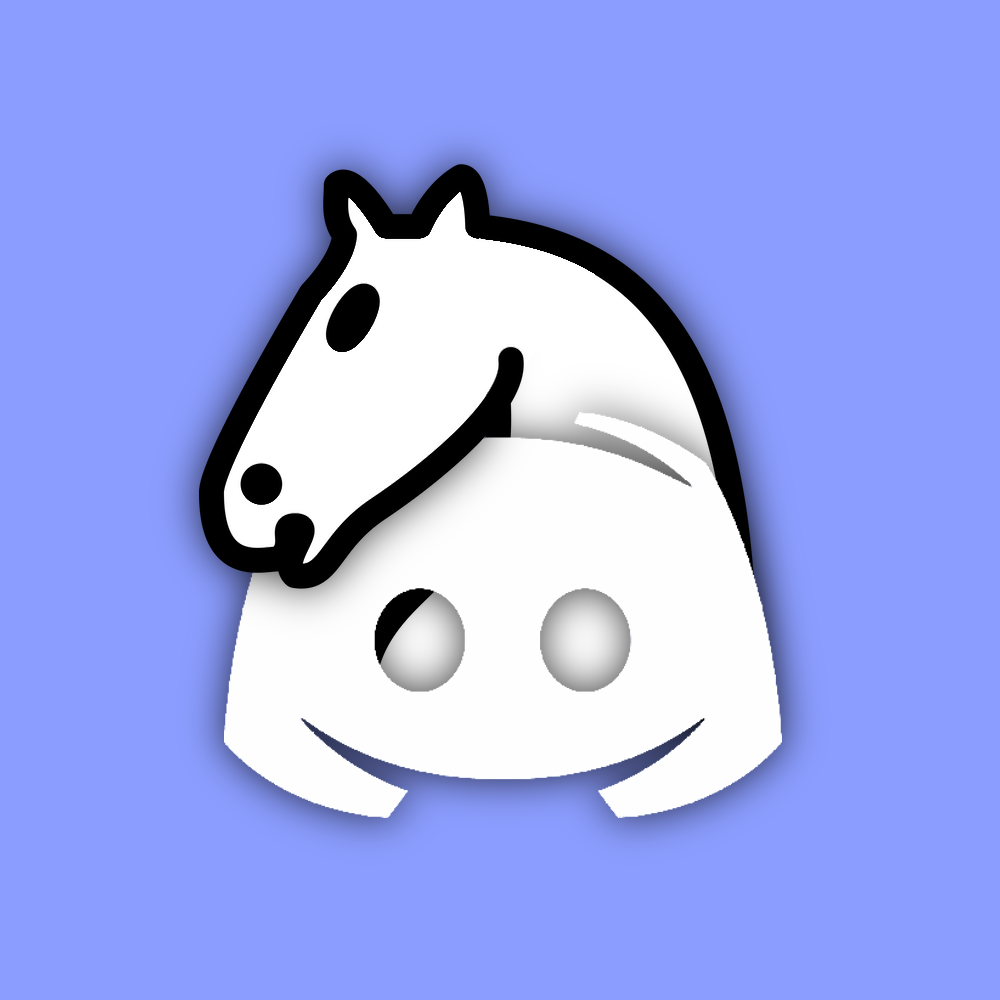

# DiscordChess

DiscordChess is a discord bot that allows users to play chess using discord

## Discord bot
### Invitation
The Bot only needs the following permissions:
- Send Messages
- Add Reactions
- Use External Emoji
- Manage Messages

To quickly add the bot to your server, click [here](https://discord.com/api/oauth2/authorize?client_id=827207000005541909&permissions=272448&scope=bot)

### Commands
The prefix for the Bot is `%`

#### Help and Information
`%help`

#### Creating a new game
To create a new game with another member, run
`%game create <Member ID/Mention> [optional: Name of the game]`

Also, you can create a custom game by loading a [FEN String](https://en.wikipedia.org/wiki/Forsyth%E2%80%93Edwards_Notation):
`%game load <Member ID/Mention> <"FEN String (encapsulated in quotation marks)"> ["optional: Name of the game (encapsulated too)"]`

You cannot play two games against the same player simultaneously. Also, you cannot play against a discord bot.

#### Show all of your current (not finished) games
`%game` without any argument. To jump to one of these games, click on the name of the game.

### Give up and offer a draw
To give up, you need to click on the ❌, if it's your turn, otherwise, it won't work

To offer a remis, click on 🤝, whether it is your turn or not.
Your opponent has click on this emoji too, in order to accept the remis.
Attention: If you are offering a draw and your opponent continues playing, the offer will be rejected automatically!

## Chess framework
...
